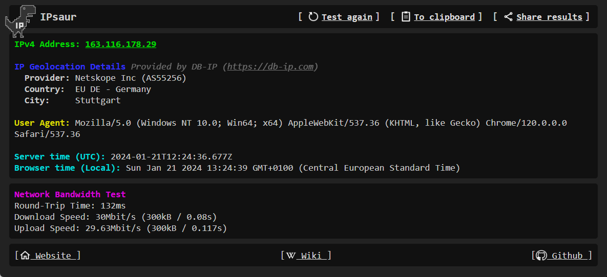
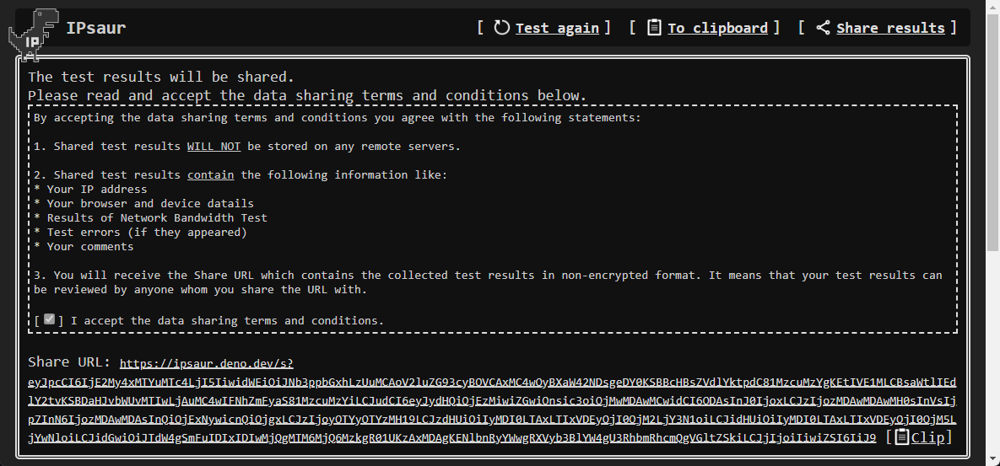
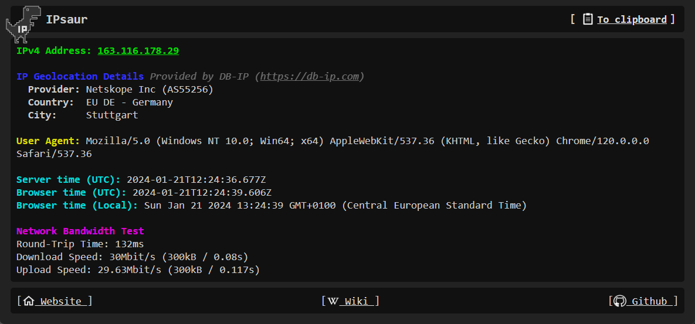
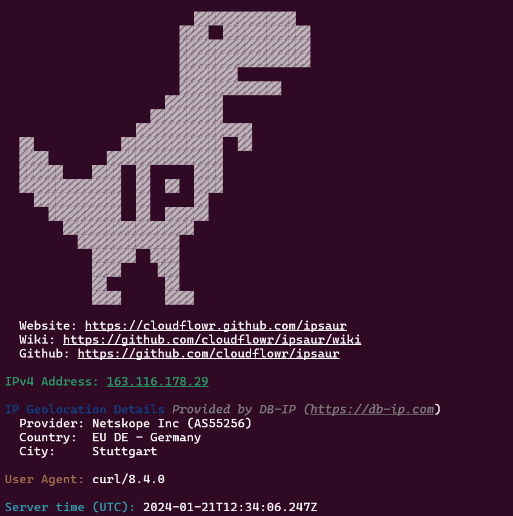
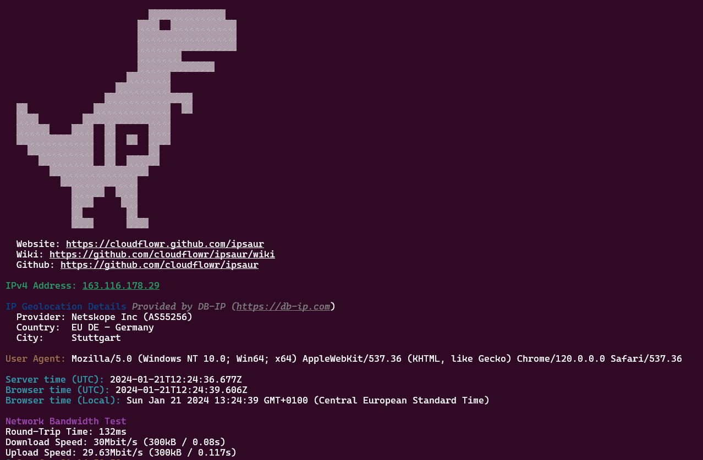

IPsaur
============

IPsaur is a simple self-hosted IP and network bandwidth checker based on [Deno](https://deno.com).

## Demo

Try IPsaur at https://ipsaur.deno.dev/.

## Buy me a coffee

Whether you use this project, have learned something from it, or just like it, please consider supporting it by buying me a coffee, so I can dedicate more time on open-source projects like this :)

<a href="https://www.buymeacoffee.com/pavel.lechenko" target="_blank"></a>

## Features

- Self-hosted on your premises (can be VM/Docker container/Lambda/etc.)
- Small memory footprint (~200MB)
- Uses MaxMind/DB-IP GeoLocation DBs
- Includes simple network bandwidth tester
- Test results can be copied to clipboard
- Test results can be shared with others as URL. Results are not persisted anywhere.
- Results can be received from server in json or yaml format

## Setup

1. Install Deno as described [here](https://docs.deno.com/runtime/manual/getting_started/installation).

2. Clone the repository

```shell
git clone https://github.com/CloudFlowr/IPsaur
cd IPsaur
```

3. Review `config.ts` file.

4. Run IPsaur using command:

```shell
deno run --allow-net --allow-read --allow-env ./main.ts
```

## Usage

### Browser

If you reach the IPsaur using web browser it will open a web page with IP address details and will perform the Network Bandwidth Test.



You can copy results to clipboard or generate a share URL.



Then open the Share URL on another computer:



### cURL

IPsaur supports output to cURL.

```shell
curl https://ipsaur.deno.dev/
```



Shared URL can be also opened in cURL:

```shell
curl https://ipsaur.deno.dev/s?eyJpcCI6IjE2My4xMTYuMTc4LjI5IiwidWEiOiJNb3ppbGxhLzUuMCAoV2luZG93cyBOVCAxMC4wOyBXaW42NDsgeDY0KSBBcHBsZVdlYktpdC81MzcuMzYgKEtIVE1MLCBsaWtlIEdlY2tvKSBDaHJvbWUvMTIwLjAuMC4wIFNhZmFyaS81MzcuMzYiLCJudCI6eyJydHQiOjEzMiwiZGwiOnsic3oiOjMwMDAwMCwidCI6ODAsInJ0IjoxLCJzIjozMDAwMDAwMH0sInVsIjp7InN6IjozMDAwMDAsInQiOjExNywicnQiOjgxLCJzIjoyOTYyOTYzMH19LCJzdHUiOiIyMDI0LTAxLTIxVDEyOjI0OjM2LjY3N1oiLCJidHUiOiIyMDI0LTAxLTIxVDEyOjI0OjM5LjYwNloiLCJidGwiOiJTdW4gSmFuIDIxIDIwMjQgMTM6MjQ6MzkgR01UKzAxMDAgKENlbnRyYWwgRXVyb3BlYW4gU3RhbmRhcmQgVGltZSkiLCJjIjoiIiwiZSI6IiJ9
```




### Output formatting

#### IP address only

To receive your IP addresss only just use `/ip` handler

```shell
curl https://ipsaur.deno.dev/ip
```

#### JSON

Add http header `Content-Type: text/json` or `Content-Type: application/json`

```shell
curl https://ipsaur.deno.dev -H 'Content-Type: text/json'
```

Or use handler `/json`

```shell
curl https://ipsaur.deno.dev/json
```

#### YAML

Add http header `Content-Type: text/yaml` or `Content-Type: application/yaml`

```shell
curl https://ipsaur.deno.dev -H 'Content-Type: text/yaml'
```

Or use handler `/yaml`

```shell
curl https://ipsaur.deno.dev/yaml
```

## Built with

IPsaur uses the following libraries:

* [node-maxmind](https://github.com/runk/node-maxmind)
* [EJS](https://github.com/mde/ejs)

## License

This project is licensed under the **MIT license**.

See [LICENSE](LICENSE) for more information.
